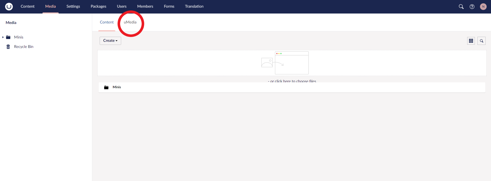
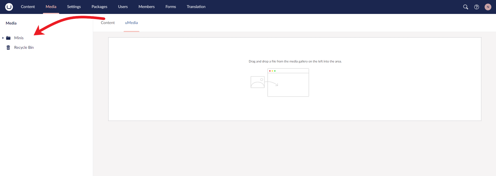
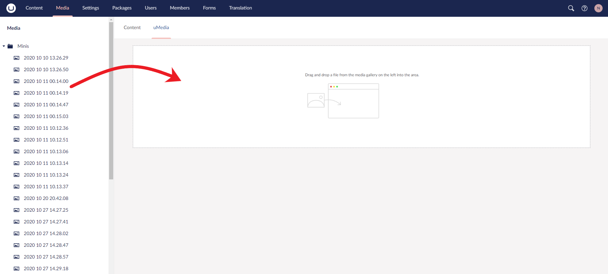
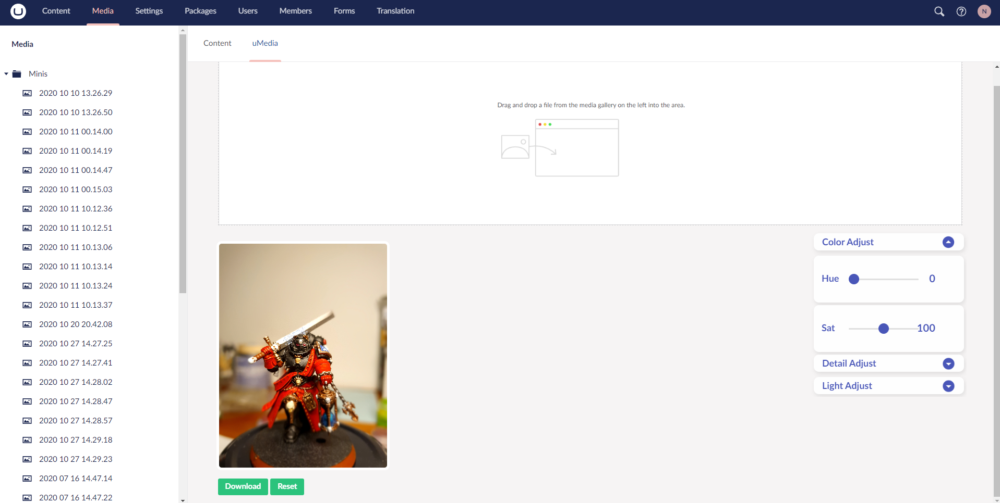

# UMediaEditor

## Description

Wanting to get more familiar with development, as well as wanting to become part of the community of Umbraco, we set out to expand the capabilites of the Umbraco backoffice Media tab by implementing some basic editing features.
We noticed a few areas where the Media tab could be expaned.
-Download button to bring photos from the backoffice to a local machine
-Sliders to adjust photos in the backoffice simliar to the features you can find on a smart phone
-Save button which allows you to save changes made on an image from the backoffice, as a new image in the backoffice or overwritting the original image.

## Installation

Using Nuget run the command "" in your project folder to install uMedia editor 

## Usage

After navigating into the Umbraco backoffice, make your way to the media tab, here you will find a new tab on the dashboard.
    
Once you enter the uME Dashboard, use the drop down of the tree view to select your photo, draging it onto the editor area.
    
    
From here you're able to make edits to your image using the drop down menus on the right hand side, and save your image using the buttons under the image.
    

## Credits

Davis Hedgepeth | https://github.com/dhedgepeth

Nix Chaves-Solorzano | https://github.com/Nixdot

animate-css | https://github.com/animate-css/animate.css

## License

## How to Contribute

    WIP
